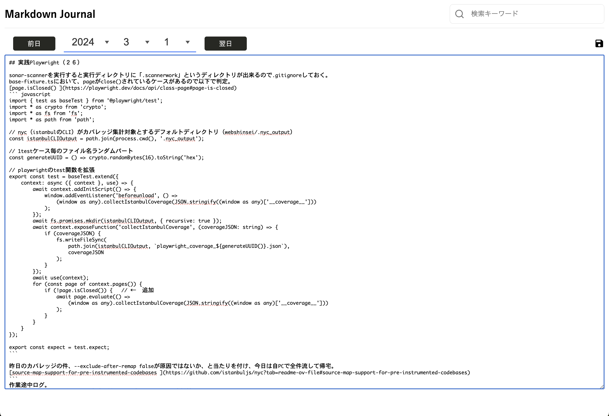

# Mdj

A tool for writing a personal web diary using Markdown.

## Structure

- mdj: Angular frontend. 
- [mdj-server](https://github.com/sin7k24/mdj-server): Express backend.

## Screenshots

### Diary View

### Edit View
